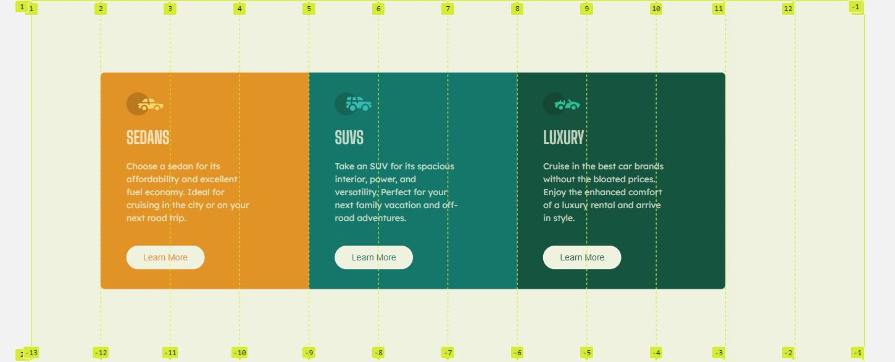

# 3 column-preview-card


## Table of contents

- [Overview](#overview)
- [The challenge](#the-challenge)
- [Screenshot](#screenshot)
- [Links](#links)
- [My process](#my-process)
- [Built with](#built-with)
- [What I learned](#what-i-learned)
- [Author](#author)


## The challenge

Your challenge is to build out this 3-column preview card component and get it looking as close to the design as possible.

Your users should be able to:

- View the optimal layout depending on their device's screen size
- See hover states for interactive elements

### Screenshot



### Links

- Solution URL: [Solution URL](https://github.com/Gandah/Frontend-Repo/tree/main/3-column-preview-card)
- Live Site URL: [Site URL](https://3-column-preview-card-eight-omega.vercel.app/)

## My process

### Built with

- Semantic HTML5 markup
- CSS custom properties
- Flexbox
- CSS Grid


### What I learned

Used display : block, width and text-align to align img element within a container which itself is in flexbox container to the left side of the screen instead using margins and padding.
To see how you can add code snippets, see below:

```css
.icon{
    width:100%;
    display: block;
    text-align: left;
    margin: 0;
}

.icon img{
    max-width: 100%;
    display: block;
    height: auto;
    object-fit: contain;

}
```
## Author

- Website - (https://www.linkedin.com/in/gandahkelvin)
- Frontend Mentor - [@Gandah](https://www.frontendmentor.io/profile/Gandah)
- Twitter - [@mr_g4nderson](https://twitter.com/mr_g4nderson?t=A5NobjZab2sVEdh3Zq9s0A&s=09)

