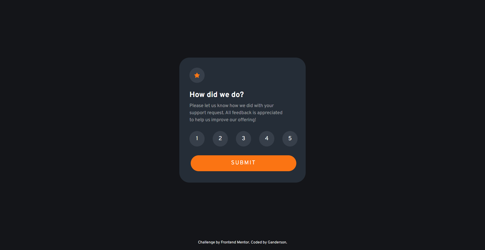

# Frontend Mentor - Interactive rating component solution

This is a solution to the [Interactive rating component challenge on Frontend Mentor](https://www.frontendmentor.io/challenges/interactive-rating-component-koxpeBUmI). Frontend Mentor challenges help you improve your coding skills by building realistic projects. 

## Table of contents

- [Frontend Mentor - Interactive rating component solution](#frontend-mentor---interactive-rating-component-solution)
  - [Table of contents](#table-of-contents)
  - [Overview](#overview)
    - [The challenge](#the-challenge)
    - [Screenshot](#screenshot)
    - [Links](#links)
  - [My process](#my-process)
    - [Built with](#built-with)
    - [What I learned](#what-i-learned)
  - [Author](#author)
  

## Overview

### The challenge

Users should be able to:

- View the optimal layout for the app depending on their device's screen size
- See hover states for all interactive elements on the page
- Select and submit a number rating
- See the "Thank you" card state after submitting a rating

### Screenshot



### Links

- Solution URL: [solution URL](https://github.com/Gandah/Frontend-Repo/tree/main/interactive-rating-component)
- Live Site URL: [live site](https://interactive-rating-card-kappa.vercel.app/)

## My process

### Built with

- Semantic HTML5 markup
- CSS custom properties
- Flexbox
- CSS Grid
- Mobile-first workflow
- [JQUERY](https://jquery.com/) - JS library

### What I learned

To see how you can add code snippets, see below:

-using the attribute and value role and button to make element act as a button
- how to make images scale proportionately within their containers using css
- to use max-content and min-content to keep contents within their containers and adapt to container sizing
- to use the document.ready function in jquery to insure document loaded before running the script, use URLSearchParams object to retrieve data from a form on another page.

```html
<input class="submit-btn" type="submit" value="Submit" role="button">
```
```css
.star-icon svg{
    display: block;
    max-width: 100%;
    height: auto;
}

.alert-container {
        width: max-content;
    }

  .main-page{
        width: min-content;
    }
```
```js
$(document).ready(function() {
    let urlParams = new URLSearchParams(window.location.search);
});
```

## Author

- Website - (https://www.linkedin.com/in/gandahkelvin)
- Frontend Mentor - [@Gandah](https://www.frontendmentor.io/profile/Gandah)
- Twitter - [@mr_g4nderson](https://twitter.com/mr_g4nderson?t=A5NobjZab2sVEdh3Zq9s0A&s=09)
